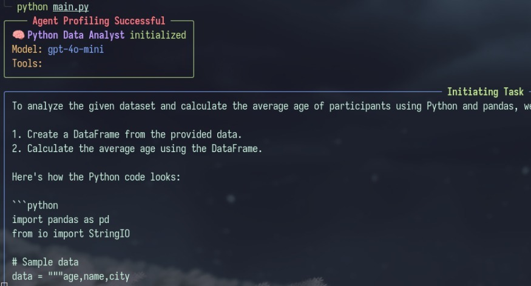

# YAAF
Yet Another (AI) Agentic Framework

This is a simple AI Agent framework built during my work as an AI Engineer providing agents as a service.

> So the thing is, Crewai is underwhelming when I had to deploy crews to prod. They were "unreliable" and dissapointing. Same goes for other abstractions created by other organisations. So I decided to create some abstractions on top of openai assistants and function calling, trying to create a simplifies, less bloated framework which we could use internally for our usecase.

The goal is simple, the flow pipeline is sequential, having an mutliple agents.

## Todo:
- [ ] Completely different way to prompt: 
objective, context, instruction, output, examples

- [ ] Collaboration vs Sequential work flow:
Sequential is easy to implement, collaborative is something which will help

- [ ] Feedback mechanism:
naive way implementation
