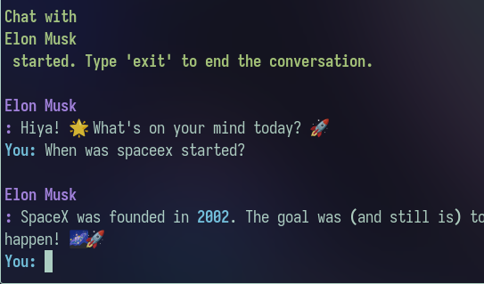

# Atlas
Atlas - Yet Another (AI) Agentic Framework

Our Inhouse Framework to create custom AI Agents with ease and zero coupling

> So the thing is, Crewai is underwhelming when I had to deploy crews to prod. They were "unreliable" and dissapointing. Same goes for other abstractions created by other organisations. So I decided to create some abstractions on top of openai assistants and function calling, trying to create a simplifies, less bloated framework which we could use internally for our usecase.

The goal is simple, the flow pipeline is sequential, having an mutliple agents.

## Outline:
4 Different types of AI Agents
* Assistants: Uses openai assistants under the hood. Function calling + Fast
* Persona Bot Assistants: Assistants in a loop with the user
* ReAct based Agents: Run a Reasoning and Action loop to get things done
* PAL Agents: Program-Aided Language models built for problem solving

## Todo:
- [ ] Completely different way to prompt: 
objective, context, instruction, output, examples

- [ ] Collaboration vs Sequential work flow:
Sequential is easy to implement, collaborative is something which will help

- [ ] Feedback mechanism:
naive way implementation
